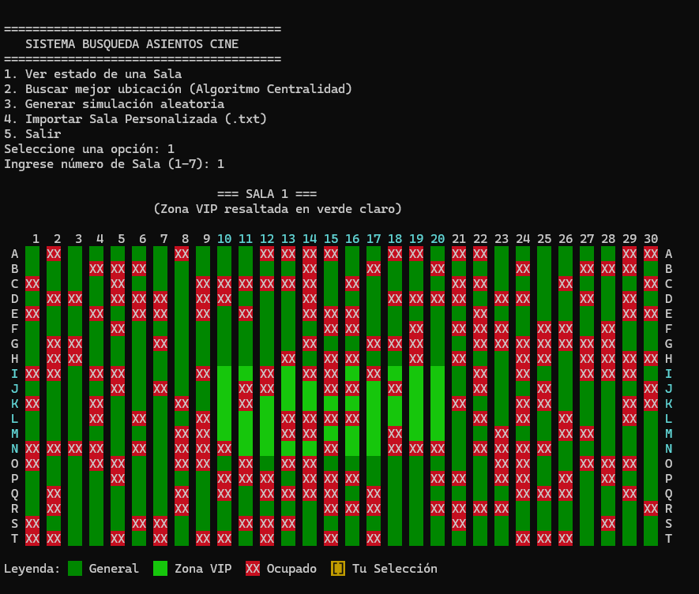

# 🎬 Cine Smart System

> Sistema de gestión de reservas de cine en consola implementado en C++.

Este proyecto simula un sistema de venta y asignación de asientos optimizado. A diferencia de una búsqueda lineal tradicional, este sistema utiliza un **Algoritmo de Búsqueda Heurística** que prioriza la centralidad de la sala y la agrupación de espectadores, evitando asignaciones en esquinas o filas dispersas.

## Características Principales

*   **Visualización Gráfica en Consola:** Uso de códigos de escape ANSI para renderizar un mapa de la sala con colores:
    *    **Verde Oscuro:** Asientos Generales Libres.
    *    **Verde Neón:** Zona VIP (Mejor visión).
    *    **Rojo:** Ocupado.
    *    **Dorado:** Selección sugerida.
*   **Algoritmo "Best-Fit Centroid":** 
    *   Calcula la distancia euclidiana desde el centro geométrico de la sala hacia los grupos de asientos vacíos.
    *   Garantiza que el usuario siempre reciba la ubicación más céntrica disponible.
*   **Gestión de Archivos:** Capacidad de importar estados de sala personalizados desde archivos de texto plano (`.txt`) simulando la lectura de discos.
*   **Zonificación:** Diferenciación lógica y visual entre Zona VIP (Centro) y General.

## Tecnologías

*   **Lenguaje:** C++ (Standard 11 o superior).
*   **Interfaz:** Consola (CLI) con soporte UTF-8 y ANSI Colors.
*   **Persistencia:** Lectura de archivos de texto (Streams).

## Cómo Usar

### 1. Compilación
Puedes compilar el proyecto usando `g++`:

```bash
g++ main.cpp -o cine_system
```

### 2. Ejecución
```bash
./cine_system
```

### 3. Importar Salas Personalizadas
Para usar la función de importación, crea un archivo `.txt` en la misma carpeta del ejecutable. El formato debe ser una matriz de 20x30 compuesta por `0` (Libre) y `1` (Ocupado).

Ejemplo (`mi_sala.txt`):
```text
0 0 0 0 ... (30 columnas)
1 1 0 0 ...
... (20 filas)
```

## Capturas

<p align="center">
  
</p>

## Autores

*   **[GRUPO 3]** - *Desarrollo y Lógica Algorítmica*

---
*Proyecto realizado para el curso de Organización de Archivos.*

---
